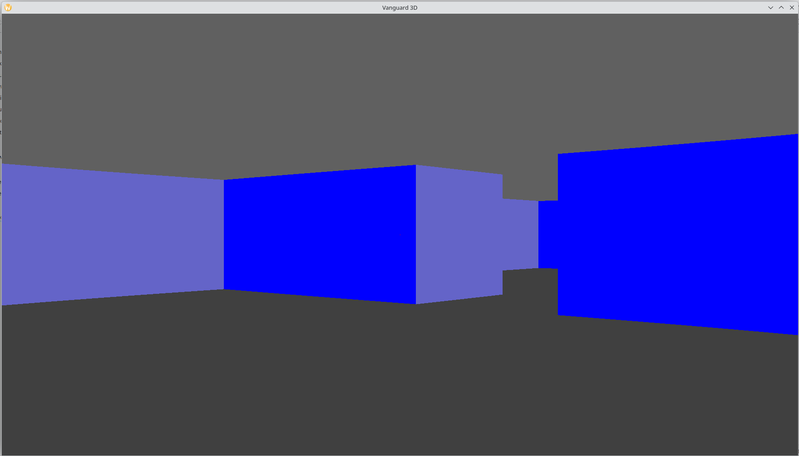
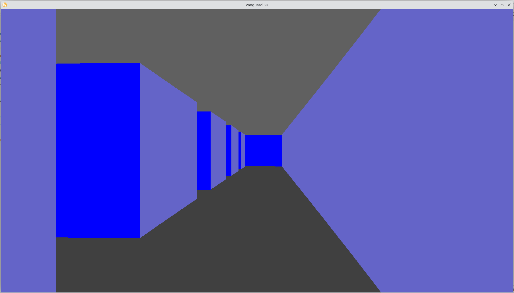

## About
Vanguard 3d is a Wolfenstein 3D like software renderer fps. Made using sdl2. 

Currently just featuring basic rendering and movement. But I intend to make it into a functional game with enemies

## Compiling

Compile by running the command `make` in the project directory.
You may need some sdl dev dependencies.

