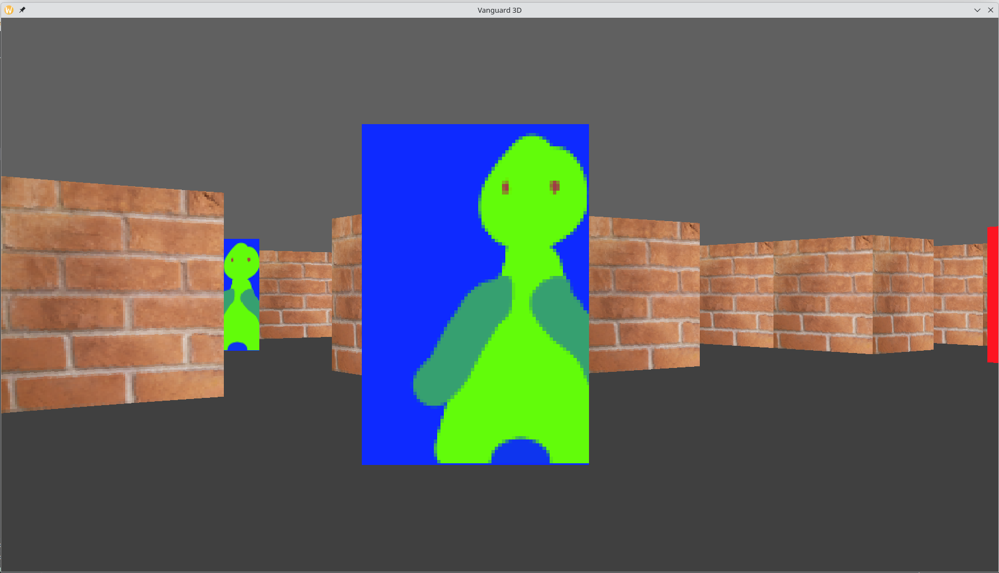
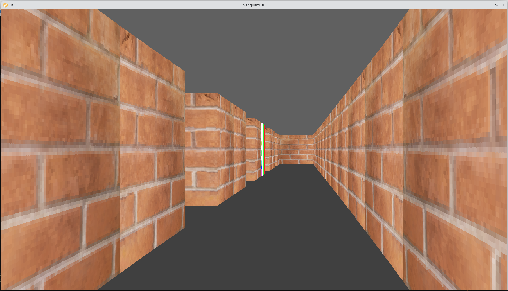

## About
Vanguard 3d is a Wolfenstein 3D like software renderer fps. Made using sdl2. 

## Features

Textured Walls, sprites, m&kb movement

This project is an excuse to try out some cool algorithms and practice C++ and low level stuff:  
Raycasting, colision response, frame rate cap, deltatime, double buffering, nearest neighbour texture filtering, frustum culling, sprites drawn with painters algorithm

## Planned Features

Gameplay Aspects, Enemy AI, health, Weapons level transitions, level editor, additional decorative sprites

Probably an alien spaceship theme

## Compiling

Compile by running the command `make` in the project directory.
You may need some sdl dev dependencies. Only tested on linux at the moment.

